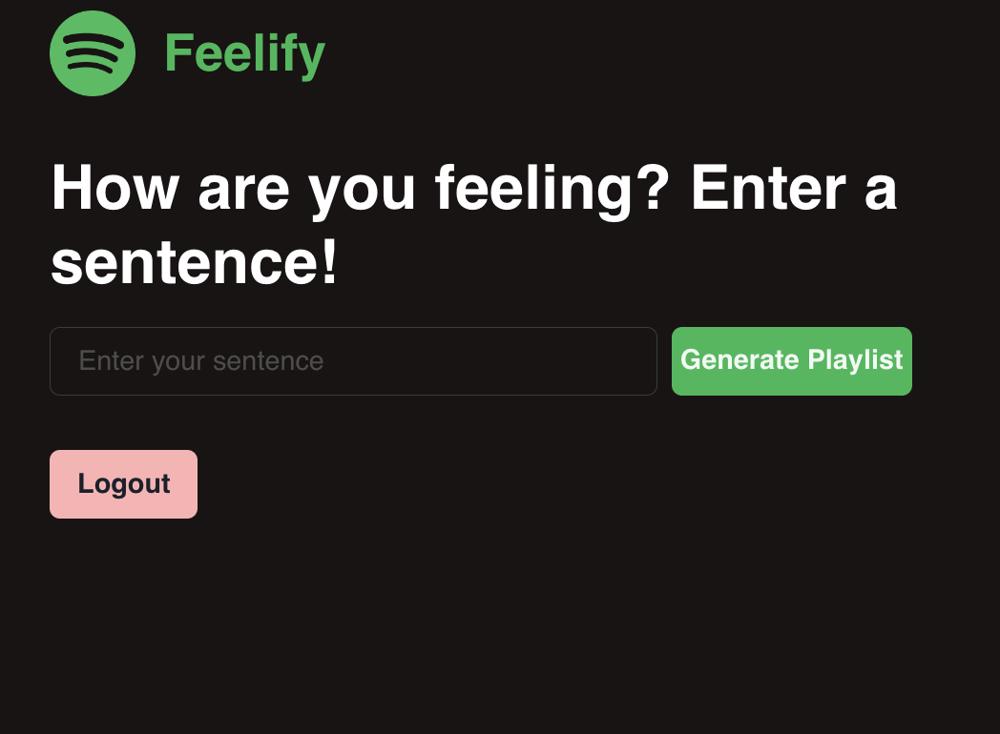

# Feelify!
Have you ever thought to yourself, "Man this playlist does not match my vibe rn"? Us too. Enter Feelify! Feelify is a full-stack web application backed by machine learning to take a user's input prompt and turn it into a playlist they can add to their Spotify account.

There are three main segments of this project: **frontend**, **backend**, and **model-backend**. Each is divided by their own directory.

## Frontend
To run the frontend, first pull all node packages:

`npm i`

Then just start the react server:

`npm start`

## Backend
The backend is pretty simple. Again, pull all node packages:

`npm i`

Then start the express server:

`node server.js`

**NOTE!** You will need to get your own Spotify API Key from the [Spotify Developer Dashboard](https://developer.spotify.com/) and use that key in server.js.

## Model-backend
First, pull all pip packages:

`pip3 install requirements.txt`

Then just run the main server:

`python3 main.py`

**NOTE!** You will need to get your own OPENAI API Key from the [OPENAI Developer Dashboard](https://platform.openai.com/) and use that key in main.py.